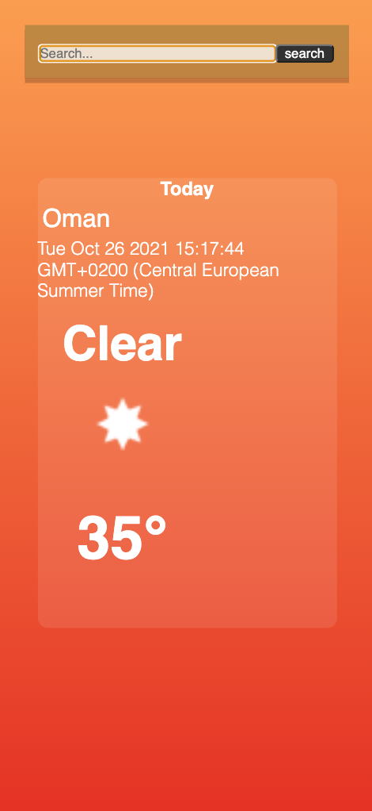
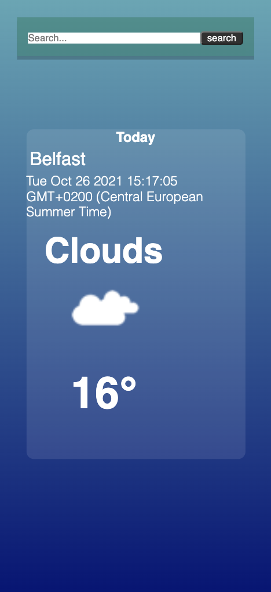

# Weather App

 

## Live Demo

[Weather App](https://aimhark.github.io/weather-app/)

## About the Project

This weather app is a react web application. I wanted to practice using React at the end of our Single Page Application module, so I built this. This weather app utalised the [openweathermap](https://openweathermap.org/api) API to give the current days forecast. 

## Built With

- Javascript/ ES6
- React
- CSS

## Author

[Aimee Harkin](https://github.com/aimhark)
